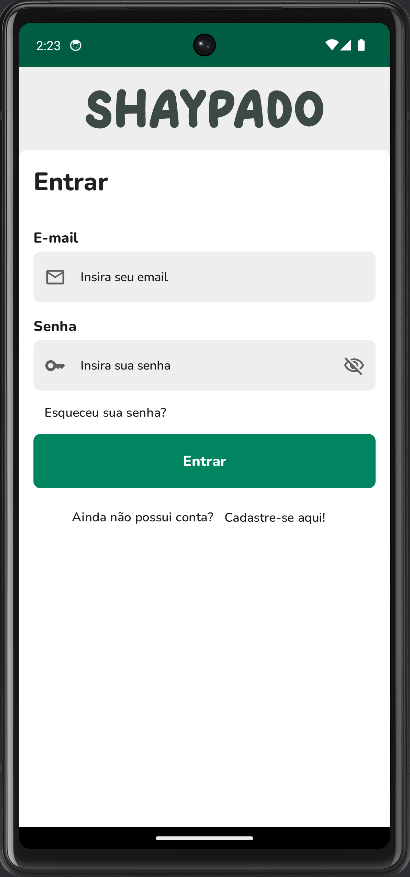
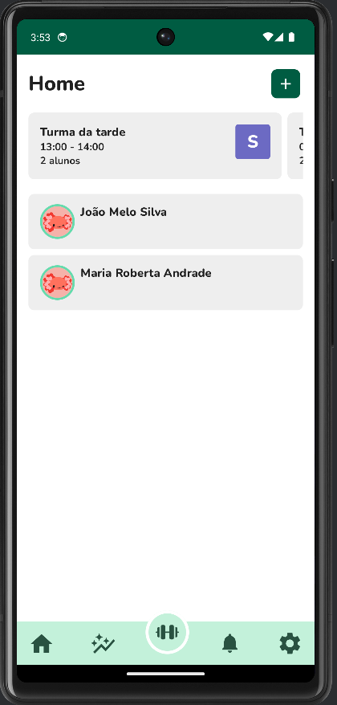
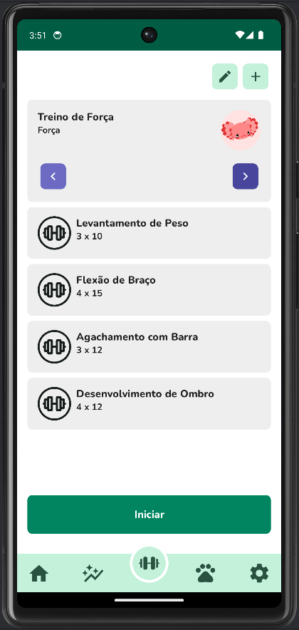
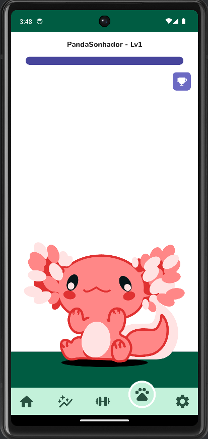
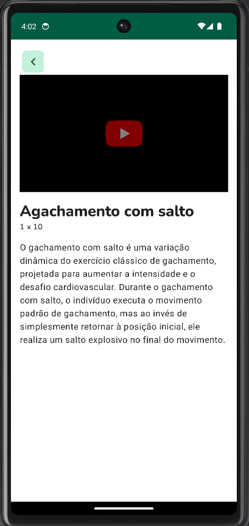
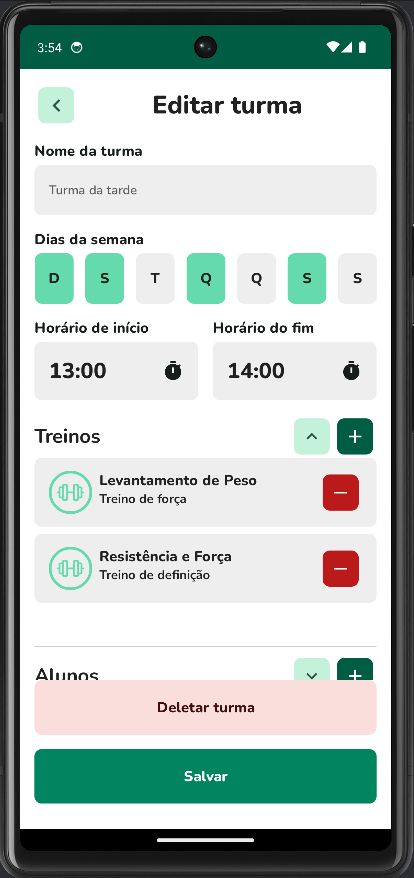
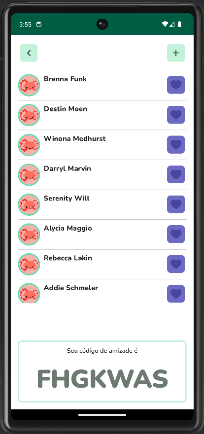
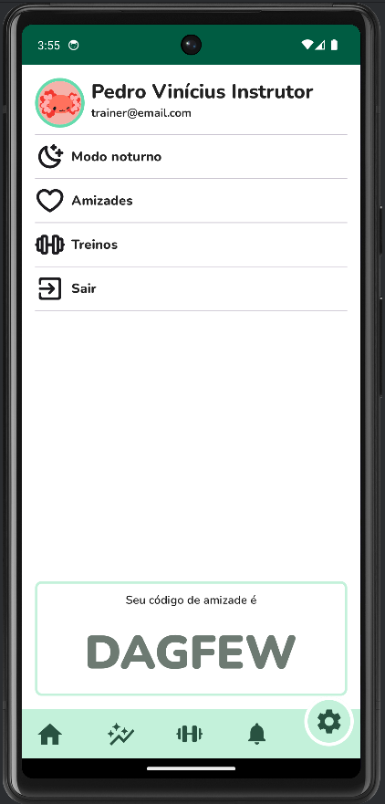

# Shaypado

O projeto Shaypado é uma iniciativa que visa proporcionar uma experiência única e motivadora para os entusiastas e iniciantes de atividades físicas. Diante da crescente preocupação com a saúde e bem-estar, o Shaypado surge como uma solução abrangente para motivar os usuários a se engajarem em exercícios e acompanharem de perto seu progresso.

A era moderna trouxe consigo um estilo de vida sedentário, contribuindo para diversos problemas de saúde. O Shaypado nasce da necessidade de combater esse padrão, incentivando as pessoas a adotarem um estilo de vida ativo, buscando construir sua própria identidade e fidelizar seus usuários. A justificativa do projeto está ancorada na promoção da saúde física, oferecendo aos usuários uma ferramenta personalizável que os mantenha motivados, conectados e comprometidos com seus objetivos fitness.

## Funcionalidades

- **Tipos de Usuário:** Atendemos dois tipos de usuários: Personais; que vendem seus serviços na plataforma e Usuário básicos que podem gerenciar seus treinos.

- **Acompanhamento de Atividades:** Os usuários podem acompanhar suas atividades físicas.

- **Recursos de IA:** Temos funções de IA como por exemplo a medição automárica de porcentagem de gordura corporal.

- **Gerenciamento de Turmas:** Você personal, organize turmas e facilite a importação de treinos e amigos para uma experiência de treino colaborativa.

- **Pet do Usuário:** Adote um pet virtual que reflete a atividade física do usuário, incentivando a manutenção de uma rotina ativa.

- **Conclusão e Visualização dos Treinos e Exercícios:** Visualize detalhes e conclusões dos treinos e exercícios realizados para acompanhar o progresso e identificar áreas de melhoria.

## Capturas de Telas

    
    
    
    
    
    
    
    

## Repositórios do Shaypado

1. [Shaypado-Mobile](https://github.com/Projeto-Des-SW/shaypado-mobile) - Este repositório
2. [Shaypado-Web](https://github.com/Projeto-Des-SW/shaypado-web) - Cliente Web do Shaypado para uso do Personal
3. [Shaypado-backend](https://github.com/Projeto-Des-SW/shaypado-backend) - Backend dos projetos
3. [Shaypado-ai](https://github.com/Projeto-Des-SW/shaypado-ai) - Backend do shaypado com relação a funções de IA

## Como executar este projeto

Se você deseja executar o projeto Shaypado, siga estas etapas:

1. Clone o repositório forkado para sua máquina local
2. Importe o projeto no Android Studio da JetBrains e aguarde a sincronização do Gradle
3. Edite as constantes `IA_BASE_URL` e `BASE_URL` no arquivo app/src/main/java/com.ufape.shaypado/di/ApiModule para refletirem o endereço do servidor backend
4. Execute normalmente seu app pela IDE em um dispositivo físico ou emulador : )

## API com mockoon

Se você deseja usar o Shaypado com o [Mockoon](https://mockoon.com/download/#download-section), siga essas etapas:

1. Instale o [Mockoon](https://mockoon.com/download/#download-section) na sua máquina
2. Importe o artigo JSON do mockoon presente na pasta `infra`
3. (Opcional) O Mockoon pode não importar as respones. Caso isso ocorra, abra JSON mencionado anteriormente e adicione as responses de acordo com as responses do app na interface do mockoon 
